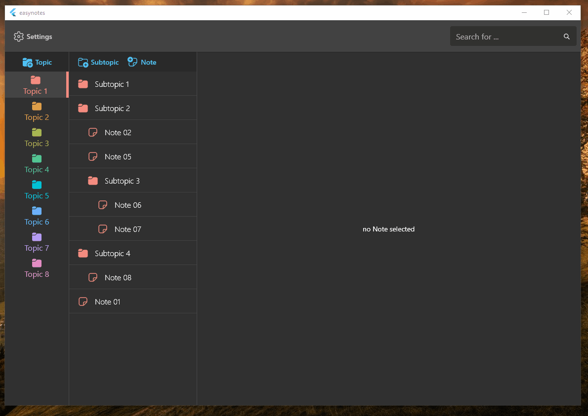

# EasyNotes

Cross-platform Flutter client (iOS, Android, and Windows) for EasyNotes (name pending!), an End-to-End-Encrypted note taking app with (to me) just the right level of abstraction: Notes inside Topics and infinitely nestable Subtopics - kind of like files and folders in your filesystem.

## Todos

- [x] UI: Login, Main Screen, Drag & Drop of Notes and Topics
- [x] End-to-End Encryption
- [ ] Keyboard Shortcuts
- [ ] Make it Self-hostable

## Demo

## Support this project

You are more than welcome to open issues or even PRs, and/or otherwise leave feedback.
However, I cannot promise to accept any PR. Kindly understand.

## Contact

Feel free to reach out on ~Twitter~ [X](https://twitter.com/yscodes).
